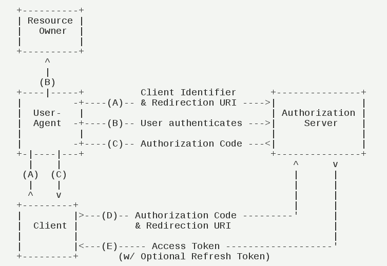

# aifgw-security-oauth2测试

### 依赖redis。本地测试redis使用默认端口（6379）即可

1. 启动认证服务。aifgw-security-oauth2
    > 端口：9001
2. 启动认证客户端，采用的是sso模式。aifgw-security-client
    > 端口：9002
3. 启动认证资源服务。aifgw-security-resource
    > 端口：9003
4. 用postman或者curl命令调用接口增加一个client
   #### 4.1 增加一个管理员
   ```
   curl -H "Content-Type:application/json" -X POST --data '{ "name": "user_1", "password": "123456", "roles": ["admin"] }' http://localhost:9001/oauth2-server/user
   ```
   #### 4.2 增加一个auth client
   ```
   curl -H "Content-Type:application/json" -X POST --data '{ "client_id": "resourceServer1", "resource_ids": ["client100"], "client_secret": "123456", "scope": "select", "authorized_grant_types": ["authorization_code", "refresh_token"], "redirect_uri": ["http://localhost:9002/oauth2-client/redirect"], "authorities": ["admin"], "access_token_validity": 7200, "refresh_token_validity": 7200, "autoapprove": ["all"], "abc": 123 }' http://localhost:9001/oauth2-server/client 
   ```
   
5. 测试
    #### 5.1 Authorization Code Flow
    
     #####1、请求authorize Code：请求第三方client应用会向认证服务器（Authorization Server）请求authorize Code
     #####2、登录：如果第一次没有登录会导向登录页面，输入我们之前新增的用户的用户名和密码，如果不是第一次，直接到第3步授权流程
     #####3、授权：登陆后就会重定向到授权界面，在界面上进行选择授权后点击授权按钮【此处缺少一个取消按钮】
     #####4、返回authorize Code：校验通过后就会生成authorize Code回调第三方client应用的回调URL
     #####5、第三方client应用接收到authorize Code：使用authorize Code等参数向认证服务器（Authorization Server）链接"oauth/token"，申请Token
      
     请求authorize Code URL：
     
        http://localhost:9001/oauth2-server/oauth/authorize?response_type=code&client_id=resourceServer1&state=xyz&redirect_uri=http://localhost:9002/oauth2-client/redirect
   
   最后浏览器展示的Token
   
   ```json
      {"access_token":"93647b05-ff20-48ec-b266-c382355fb938","token_type":"bearer","refresh_token":"595bf882-d080-4770-9df1-29569b31505d","expires_in":1467,"scope":"select read write"}
      ```
     #####6、测试resource中的受保护资源，xxx用上面的tokenValue代替
     
        http://localhost:9003/oauth2-resource/protect/1?access_token=xxx
        
     #####7、检查Token是否有效请求（/oauth/check_token）
     请求所需参数：token
     
        http://localhost:9001/oauth2-server/oauth/check_token?token=f57ce129-2d4d-4bd7-1111-f31ccc69d4d1

     #####8、刷新token请求（/oauth/token） 
      请求所需参数：grant_type、refresh_token、client_id、client_secret ，其中grant_type为固定值：grant_type=refresh_token
      
        http://localhost:9001/oauth2-server/oauth/token?grant_type=refresh_token&refresh_token=fbde81ee-f419-42b1-1234-9191f1f95be9&client_id=resourceServer1&client_secret=123456
        

