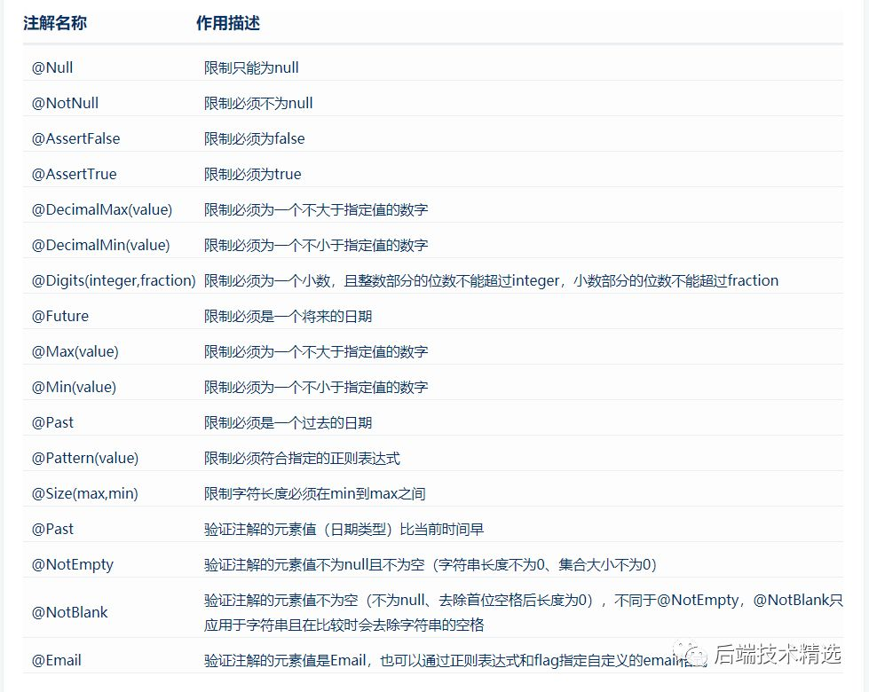

1、启动Application

2、Get请求
http://localhost:8080/user/test

3、POST请求：
curl --location --request POST 'http://localhost:8080/user2/add' \
--header 'Content-Type: application/json' \
--data-raw '{
 "username":"111",
 "password":"sa",
  "userInfo":{
    "age":19,
    "gender":"男"
  }
}'

@Valid 相关的注解，在实体类中不同的属性上添加不同的注解，就能实现不同数据的效验功能。
   

